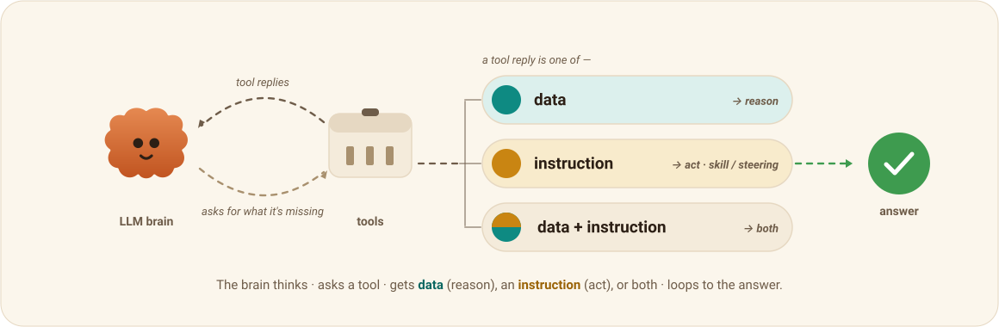

<h1 align="center">AgentThinkingUI</h1>

<p align="center"><b>Watch any agent think</b> — a drop-in player for an agent's runtime footprint.</p>

<p align="center">
  <a href="https://www.npmjs.com/package/agentthinkingui"></a>
  <a href="https://www.npmjs.com/package/agentthinkingui"></a>
  <a href="https://github.com/footprintjs/agentThinkingUI/actions/workflows/ci.yml"></a>
  <a href="https://github.com/footprintjs/agentThinkingUI/actions/workflows/ci.yml"></a>
  <a href="https://github.com/footprintjs/agentThinkingUI/actions/workflows/pages.yml"></a>
  <a href="./LICENSE"></a>
</p>

<picture>
  <source media="(prefers-color-scheme: dark)"  srcset="docs/assets/hero-dark.svg">
  <source media="(prefers-color-scheme: light)" srcset="docs/assets/hero-light.svg">
  
</picture>

<p align="center">
  <a href="https://footprintjs.github.io/agentThinkingUI/"></a>
</p>

> The brain thinks → asks a tool → the reply is **data** (reason over facts), an
> **instruction** — a **skill / steering** doc that says *how to act* — or **both**,
> and it loops to the answer.

**Watch any agent think.** AgentThinkingUI is a drop-in, framework-agnostic player
for an agent's *runtime footprint*: feed it a recorded trace and it replays the
agent loop as an animated, scrubbable story — the LLM **brain** reaching for
**tools**, the replies coming back, the reasoning building up, beat by beat. You
can time-travel through every step.

It isn't tied to any vendor, framework, or model. If you can record a run as a
small trace — a hand-rolled loop, a RAG pipeline, LangChain/LlamaIndex, Claude or
OpenAI tool-calling — AgentThinkingUI can play it. Everything visual flows through
a theme, the logic is split into small ES modules, and React is the only peer dep.

## The idea — an agent solves a problem the way a person does

Strip away the jargon and an agent loop is just how a human works through a
problem: you **think**, you realize you're missing something, you go **get** it,
and what comes back is either **facts** or **instructions** — then you keep going.

AgentThinkingUI makes that legible. Each beat is one of a few shapes:

- **The brain thinks.** The LLM reasons about the task with what it currently has.
- **The brain reaches for a tool** to get what it's missing — a search, a RAG
  lookup, a DB query, a service/API call.
- **The tool replies**, and the reply is one of three things:
  - **data** → the brain **reasons** over new facts;
  - **instruction** → a **skill / steering doc** arrives telling the brain *how to
    act* (an instruction delivered *as* a tool result);
  - **data + instruction** → both at once — reason on one half, act on the other.
- …and it **loops** until the brain has enough to give the **answer**.

That's the whole metaphor: **a brain that sometimes needs facts and sometimes
needs to be told how to proceed** — exactly how people break down hard problems.
The colour language carries it: data → *reason*, instruction → *act*.

## Quick start

The library is **scoped ES modules** with **React as a peer dependency**. Two ways
to use it.

**App / bundler (ESM):**

```bash
npm install agentthinkingui react react-dom
```
```jsx
import { AgentThinkingUI } from "agentthinkingui";
import "agentthinkingui/styles.css";

<AgentThinkingUI trace={trace} />
```

**Script tag / no bundler (UMD bundle):** load React, then the prebuilt bundle —
it sets `window.AgentThinkingUI` (and the rest):

```html
<script src="https://unpkg.com/react@18/umd/react.production.min.js"></script>
<script src="https://unpkg.com/react-dom@18/umd/react-dom.production.min.js"></script>
<script src="https://unpkg.com/agentthinkingui@latest/dist/agentthinkingui.umd.js"></script>
<link rel="stylesheet" href="https://unpkg.com/agentthinkingui@latest/dist/agentthinkingui.css">
```

Either way you get the full experience — scene, inspector, notepad, timeline, and
playback, in a resizable split. Prefer your own layout? Import the four view
components yourself (below). The trace contract is **typed** — point your recorder
at [`types/index.d.ts`](types/index.d.ts).

> **No build step to *use* it** (just import or drop the bundle). The repo has a
> tiny `esbuild` step that produces `dist/` from the modular `src/` — run
> `npm run build` if you're hacking on the library itself.

## Trace schema (the contract)

This is what you produce — read it first. The trace is deliberately generic: it
describes the *shape* of an agent loop, not any one framework. It's **typed** —
the full declarations ship in [`types/trace.d.ts`](types/trace.d.ts) (and the npm
package points `types` at them), so your recorder gets autocomplete and checking.

```ts
type Trace = {
  task: string;
  title?: string;        // optional short label for the "replay" pill (falls back to task)
  agent: string; model: string; asker: string;
  steps: Step[];
};

type Step =
  | { kind: "prompt";  brain: string; cost: Cost }                       // the task comes in
  | { kind: "ask";     tool: string; toolName?: string; input: object;   // brain reaches for a tool
      brain: string; cost: Cost }
  | { kind: "return";  tool: string; toolName?: string;                  // the tool replies
      replyType: "data" | "instruction" | "both";
      output: object; brain: string; cost: Cost;
      brainMode?: "reason" | "act";        // data → reason, instruction → act
      skill?: string; actChecklist?: { text: string }[];   // for instruction / both (skill / steering)
      actNote?: string;                     // the "acts on the instruction" note (both)
      error?: string }                      // set when the tool/step failed → rendered red
  | { kind: "answer";  to: string; brain: string; answer: Answer; cost: Cost; error?: string };

type Cost = {
  ms: number; tokens: number;              // latency + total tokens
  tokensIn?: number; tokensOut?: number;   // input / output split (cost attribution)
  tokensCached?: number;                   // cache-read tokens (cache-hit visibility)
};
```

The three `replyType`s are the model from the hero: **data** (reason),
**instruction** (act on a **skill / steering** doc), and **both** — the mixed
case, where the reply carried data **and** an instruction, so the brain reasons on
one half and acts on the other (two bubbles). A step that **failed** carries
`error` and renders red across the scene, timeline, inspector and notepad.

## Layout

```
src/                 # the library — ES modules (import/export, scoped)
  theme.js           Theming engine — normalize / toVars / apply (colors, fonts, icons, labels)
  layout.js          Pure geometry (arcLayout): anchors + arc paths. No React.
  playback.js        Time-travel — usePlayback(trace): step, play/pause, speed, live tail
  stage.jsx          <Stage>     — the runtime "thinking" scene (brain, toolbox, arcs, bubbles)
  inspector.jsx      <Inspector> per-step detail + <Notepad> chronological journal
  timeline.jsx       <Timeline>  — time-travel scrubber + transport + legend
  footprint.jsx      <AgentThinkingUI> — ready-made shell wiring all four together
  swarm.jsx          <AgentSwarm> — multi-agent control-flow map + drill-down
  adapters/otlp.js   fromOTLP · fromOpenInference · fromOTLPMulti · fromOpenInferenceMulti (telemetry → trace/graph)
  context.js         the shared React context the views read the theme from
  index.jsx          ESM entry (re-exports)   ·   global.jsx  UMD entry (window.*)
  styles.css         Design tokens + component styles (all keyed off theme variables)

build.mjs            esbuild → dist/ (ESM + UMD + css)
demo/                # runnable example (loads the prebuilt ../dist bundle)
  index.html         One responsive demo — single player ⟷ multi-agent team, switched
                     in-app via the gear (swarm.html just redirects here for old links)
  mobile.html        phone frame (single-agent)
  trace.js           Sample single-agent runs   ·   flow-trace.js  multi-agent FlowGraphs
  app.jsx            Composition — <AgentThinkingUI> / <AgentSwarm> + gear (theme /
                     scenario / pattern / OTel · OpenInference import)
  demo-settings.jsx  Demo-only gear   ·   tweaks-panel.jsx  palette / labels / loop
```

## Components

Four independent view components, plus a default container that composes them:

| Export | Role |
|--------|------|
| `<Timeline>` | time-travel transport + colour-coded scrubber |
| `<Stage>` | the runtime "thinking" scene (brain ⇄ toolbox, bubbles, flow) |
| `<Inspector>` | per-step detail (tool I/O, reasoning, cost) |
| `<Notepad>` | chronological journal that builds up beat-by-beat |
| `<AgentThinkingUI trace>` | **default container** — wires the four + playback + a resizable split |
| `<AgentSwarm trace>` | **multi-agent** control-flow map; drills into each agent's `<AgentThinkingUI>` |

Use `<AgentThinkingUI trace={trace} />` for the whole thing, or import the four
pieces into your own layout (each takes `trace` + the playback state from
`usePlayback`). `AgentFootprint` remains as a deprecated alias of the container.

The **library** is modular `src/` (React is a peer dep). `npm run build` emits
`dist/`: an **ESM** bundle for `import`, and a **UMD** bundle that re-exposes the
same symbols on `window` for the script-tag/CDN path. The **demo** loads that UMD
bundle and shows it working — sample traces, live theming, and a live stream.

Animation **ordering** lives as one block of staged `animation-delay`s in
`src/styles.css` (search "choreography"): per beat the cloud → arc → packet →
tool/bubble fire in sequence.

## Multi-agent — `<AgentSwarm>`

Real systems have more than one agent. `<AgentSwarm>` renders a team as a
**control-flow graph** and drills into each agent's single-agent `<AgentThinkingUI>`.
It takes a **`FlowGraph`** — typed nodes + edges that compose the four primitives
(Sequence · Parallel · Conditional · Loop), which in turn express every named
pattern (Hierarchical, Debate, Router, Reflexion, Swarm, Tree-of-Thoughts). See
[`docs/multi-agent-flow.md`](docs/multi-agent-flow.md).

```jsx
import { AgentSwarm } from "agentthinkingui";

const flow = {
  task: "plan the offsite",
  nodes: [
    { id: "p", kind: "agent", name: "Planner", role: "orchestrator", icon: { kind: "emoji", value: "🧠" }, trace: plannerTrace },
    { id: "r", kind: "decision", label: "in budget?" },
    { id: "f", kind: "agent", name: "Flights", trace: flightsTrace },
    { id: "m", kind: "merge", label: "synthesis" },
  ],
  edges: [
    { from: "p", to: "r", kind: "seq" },
    { from: "r", to: "f", kind: "conditional", label: "yes", taken: true },
    { from: "f", to: "m", kind: "parallel" },
    { from: "m", to: "p", kind: "loop", label: "until done ×2" },
  ],
};

<AgentSwarm trace={flow} live={false} />
```

- **Nodes:** `agent` (shows the animated brain mascot, or `icon` emoji/image; click
  to **drill in**) · `decision` (diamond) · `merge` · `start`/`end`.
- **Edges:** `seq` · `parallel` · `conditional` (taken branch lit, rest dimmed) ·
  `loop` (dashed back-arc with an "until / ×N" label).
- **Team time-travel:** all agents' beats interleave into one scrubbable team
  timeline — the current agent lights up, a commentary line narrates the beat, and a
  toggle-able **team notepad** shows the agent-prefixed journal.
- **`live`** tails the newest beat as the graph grows (stream nodes/steps in).

## Adapters — bring your existing traces

Already instrumented? Point an adapter at your spans — no re-instrumentation.

**Supported standards:** **OpenTelemetry GenAI** (AWS Bedrock AgentCore, LangGraph,
CrewAI, AutoGen, OpenAI Agents SDK, Google ADK, Pydantic AI, Strands…) and
**OpenInference** (Arize / Phoenix / LlamaIndex) — both single- and multi-agent.

**API:**

| function | input | output |
|---|---|---|
| `fromOTLP(otlp, opts?)` | OpenTelemetry GenAI spans | `Trace` — one agent |
| `fromOpenInference(otlp, opts?)` | OpenInference spans | `Trace` — one agent |
| `fromOTLPMulti(otlp, opts?)` | OpenTelemetry span **tree** | `FlowGraph` — a team |
| `fromOpenInferenceMulti(otlp, opts?)` | OpenInference span **tree** | `FlowGraph` — a team |

```js
import { fromOTLP, fromOpenInference, fromOTLPMulti, fromOpenInferenceMulti } from "agentthinkingui";

const trace = fromOTLP(otlpJson, { asker: "Sam" });      // OTel GenAI → Trace
const trace2 = fromOpenInference(spans);                  // OpenInference → Trace
const flow = fromOTLPMulti(otlpJson, { asker: "Sam" });   // OTel span tree → multi-agent FlowGraph
const flow2 = fromOpenInferenceMulti(spans);              // OpenInference span tree → FlowGraph
```

Mapping: agent span → trace/agent-node, tool execution → ask+return, first user
message → prompt, final assistant message → answer, span duration + tokens → cost
(input/output and cache-read tokens are split out for cost attribution);
nested `invoke_agent` spans become the agent graph. The **reply type**
(`data`/`instruction`/`both`) isn't in those standards, so it's decided by an
`opts.classify(toolName, attrs)` hook → opt-in `agentthinkingui.reply_type` /
`.skill` span attributes → a heuristic (skill/steering/policy/guardrail → instruction).
**Errors are universal:** a span with status `ERROR` (or an `exception` event) becomes
a red error beat (and a red agent node in the swarm) — same for both adapters.
For **live monitoring**, accumulate spans and re-run the adapter on the growing set,
feeding `<AgentThinkingUI live>` / `<AgentSwarm live>`.

## Theming

**Preferred — pass props.** Theme flows in through `<AgentThinkingUI>`'s
`theme` / `labels` / `icons` props. The container normalizes them and applies the
resulting CSS variables to its **own element** (not `:root`), so themes are
reactive, scoped, and two players can wear different brands on one page without
leaking into the host app.

```jsx
const theme = {
  colors: {
    brand: "#2563EB",          // the brain / agent
    data: "#0EA5E9",           // data → reason   (a hex, or {base,deep,tint})
    instruction: "#F59E0B",    // instruction → act
    answer: "#16A34A",
    call: "#94A3B8",           // tool call
    paper: "#FFFFFF", ink: "#0F172A",
  },
  fonts: {
    display: "Söhne, sans-serif", body: "Inter, sans-serif",
    mono: "ui-monospace", hand: "Caveat, cursive",
    scale: 1,                  // multiplies every text size — match the host's density
  },
};

<AgentThinkingUI
  trace={trace}
  theme={theme}
  labels={{ agent: "Agent", toolbox: "tools" }}
  icons={{ brain: { kind: "emoji", value: "🤖" } }}  // or {kind:"image",value:"/bot.png"} / {kind:"default"}
/>
```

A color may be a single hex (its `deep`/`tint` shades are derived) or a full
`{ base, deep, tint }` triad for exact control. Change a prop and the player
re-themes live — no reload, no global mutation.

**Typography.** The four font *roles* — `display` / `body` / `mono` / `hand` —
are themeable so text picks up the host's families (the host loads the fonts;
unknown families fall back to `system-ui` / `cursive`). `fonts.scale` is a single
multiplier over the whole type ramp (`--af-text-scale`) so the player can match
a denser or larger host layout without restyling.

**Back-compat — page-level globals.** With the UMD bundle you can still define
`window.AGENT_THEME` (plus `window.AGENT_DISPLAY_NAME` / `window.AGENT_ICONS`)
**before** the bundle loads; it seeds the defaults on `:root` at load. Anything
omitted falls back to the built-in look. Props always win over globals.

The theme engine is importable on its own:
`import { normalize, toVars, apply } from "agentthinkingui"` (or
`AgentTheme.*` from the UMD bundle) — `normalize(opts)` → resolved tokens,
`toVars(resolved)` → a CSS-variable map, `apply(el, opts)` → write the vars onto
any element.

## Embedding

- **ESM:** `import { AgentThinkingUI } from "agentthinkingui"` + `import
  "agentthinkingui/styles.css"`. React/ReactDOM are peer deps your app provides.
- **Script tag:** load React, then `dist/agentthinkingui.umd.js` (it sets
  `window.AgentThinkingUI`) + `dist/agentthinkingui.css`. See
  [`demo/index.html`](demo/index.html).

Point a `trace` at your own recorded run (live or replay) and render — that's it.

## For AI agents

Building on top of this with a coding agent? Two guides are kept for that:

- [`AGENTS.md`](./AGENTS.md) — how to **use** the library (integration, props, the
  trace contract to emit) for an agent wiring it into another app.
- [`CLAUDE.md`](./CLAUDE.md) — how to **work on this repo** (the module/build
  constraint, globals, theming, how to run/verify).

## License

[MIT](./LICENSE) © [Sanjay Krishna Anbalagan](https://github.com/sanjay1909)
